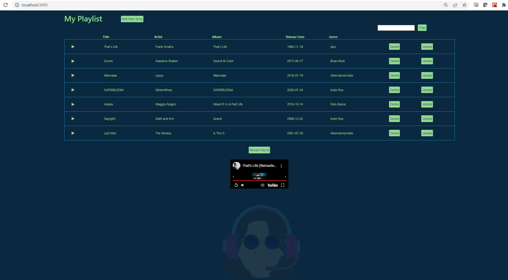

# Getting Started with Create React App

This project was bootstrapped with [Create React App](https://github.com/facebook/create-react-app).

## User Stories:

(5 points): As a developer, I want to use the Create-React-App command to create my React project. 

(10 points) As a developer, I want to use AXIOS to consume the Django REST API on the frontend.  

(10 points) As a developer, I want to display the data (song title, album, artist, genre, and release date) from the API within a table on the frontend. 

(5 points): As a developer, I want to create a minimum of three React components and use them within my React application. (EX: NavigationBar, SearchBar, MusicTable) 

(5 points) As a developer, I want to have an aesthetically pleasing user interface to ensure a great user experience. 

(10 points) As a music enthusiast, I want to be able to filter the table of music by album, artist, genre, release date, and title. 

(10 points) As a music enthusiast, I want to be able to add a song to my database by using Axios to make a POST request to the Django REST API
done, but would need to revert back to hit mvp/submit project (half-way into a modal-like thing.)
 
Bonus
(10 points) As a music enthusiast, I want to be able to update the song data in my table using a modal popup window that initiates a PUT request to the Django REST API

(5 points) As a music enthusiast, I want to be able to delete a song from my table, initiating a DELETE request to my Django REST API

